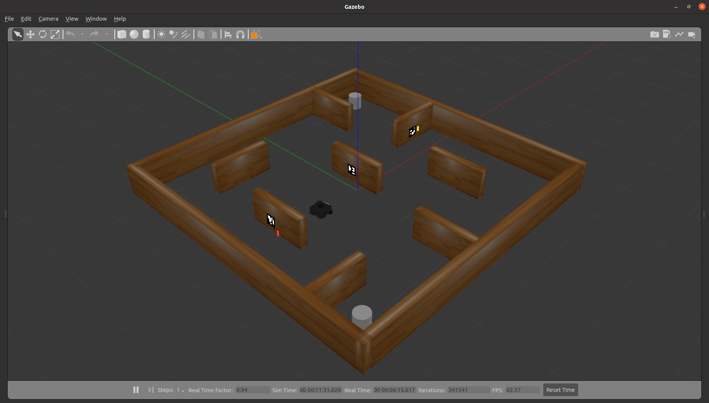

# Helpbot
This project turns a Turtlebot into a helper to get certain objects across a map. 
It starts on a position next to the human user, which will show the Turtlebot's camera a certain number of fingers, corresponding to colos Red, Green, Blue and Yellow, respectively.
After that, the robot will navigate to certain positions in the map which are possible locations of the desired object, so when the robot founds that, it will buzz and then return with the user.



## Dependencies 

- [ROS Noetic (full version)](http://wiki.ros.org/noetic/Installation/Ubuntu)
- [Pyhton 3.8.10](https://www.python.org/downloads/)
- [OpenCV 4.5.5](https://opencv.org/releases/)
- [Turtlebot3 Package](https://github.com/ROBOTIS-GIT/turtlebot3)
- [Navigation Stack Package](https://github.com/ros-planning/navigation)

### Installing

- You can (optionally) create a conda environment: 
```sh
conda create -n <name> python=3.8
conda activate <name>
```

- Install the requirements with the following command: ```pip install -r requirements.txt```

- Create a new workspace and copy both packages "helpbot" and "obj_recognition" in the src folder. You can clone the repository if you need: ```git clone https://github.com/crisrm128/helpbot.git```

- Replace the stage 4 in Gazebo (route ```/opt/ros/noetic/share/turtlebot3_gazebo/worlds```) with the script ```turtlebot3_stage_4.world```

- Add the models in the ```models``` folder to the destination: ```/home/username/.gazebo/models```.

## Executing program in turtlebot3 simulation

### Mapping (Launch version)

- Terminal/Console 1. Launch the mapping.launch file: 
```sh
roslaunch helpbot mapping.launch
```

- Terminal/Console 2. Run the mapping node:
```sh
rosrun helpbot mapping.py
```

### Mapping (Console version)

- If you want to see the teleop keyboard shortcuts, you can follow these steps:

- Terminal/Console 1. Launch gazebo:
```sh
roslaunch turtlebot3_gazebo turtlebot3_stage_4.launch
```

- Terminal/Console 2. Launch slam method:
```sh
roslaunch turtlebot3_slam turtlebot3_slam.launch slam_methods:=gmapping
```

- Terminal/Console 3. Launch teleoperation:
```sh
roslaunch turtlebot3_teleop turtlebot3_teleop_key.launch 
```

- Terminal/Console 4. Run aruco recognition node:
```sh
rosrun obj_recognition aruco_recog.py
```

- Terminal/Console 5. Run the mapping node:
```sh
rosrun helpbot mapping.py
```

### Navigation

- Terminal/Console 1. Launch the navigation.launch file: 
```sh
roslaunch helpbot navigation.launch
```

- Terminal/Console 2. Run the mapping node:
```sh
rosrun helpbot navigation.py
```

- Because in simulation you can't work with real hand gestures, you will need to manually publish in the following topic the color of the object desired:
```sh
rostopic pub /colour_obj std_msgs/String "Amarillo"
```

## Executing program in turtlebot2 real robot

The commands with the ```*``` symbol means they need to be executed after doing the commands: 
```sh
ROS_MASTER_URI=http://<turtlebot-ip>:11311
ROS_HOSTNAME=<your-ip>
ssh turtlebot@turtlebot-ip
```

### Mapping

- Terminal/Console 1*:
```sh
roslaunch turtlebot_bringup minimal.launch
```

- Terminal/Console 2*:
```sh
roslaunch turtlebot_bringup hokuyo_ust10lx.launch
```

- Terminal/Console 3*:
```sh
roslaunch astra_launch astra.launch
```

- Terminal/Console 4*:
```sh
roslaunch turtlebot_navigation gmapping_demo.launch
```

- Terminal/Console 5*:
```sh
roslaunch turtlebot_teleop keyboard_teleop.launch
```

- Terminal/Console 6. Run aruco recognition node:
```sh
rosrun obj_recognition aruco_recog.py
```

- Terminal/Console 7. Run the mapping node:
```sh
rosrun helpbot mapping.py
```

- Terminal/Console 8.* When you finish, save the map:
```sh
rosrun map_server map_saver -f mi_mapa
```


### Navigation

- Terminal/Console 1*:
```sh
roslaunch turtlebot_bringup minimal.launch
```

- Terminal/Console 2*:
```sh
roslaunch turtlebot_bringup hokuyo_ust10lx.launch
```

- Terminal/Console 3*:
```sh
roslaunch astra_launch astra.launch
```

- Terminal/Console 4*:
```sh
export TURTLEBOT_3D_SENSOR=astra
roslaunch turtlebot_navigation amcl_demo.launch map_file:=/home/turtlebot/mi_mapa.yaml

```

- Terminal/Console 5. Run the mapping node:
```sh
rosrun helpbot navigation.py
```


## Notes

- In the scripts ```mapping.py``` and ```navigation.py``` , make sure you modified the directory ```/home/cristina/ws_helpbot/src/helpbot/src/maps/poses.txt``` to your desired directory with contains the poses.txt file.

- Make sure all the ```.py``` scripts have executing permissions. If not, run the command ```sudo chmod +x filename.py```.

## Authors

- [Jorge Beltrá Fuerte](https://github.com/jbeltraf13)
- [Cristina Romero Mirete](https://github.com/crisrm128)
